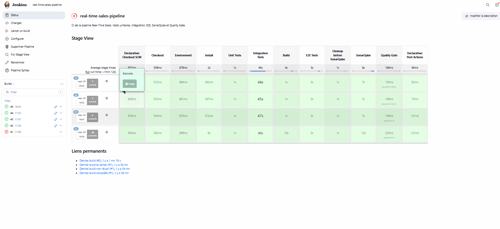
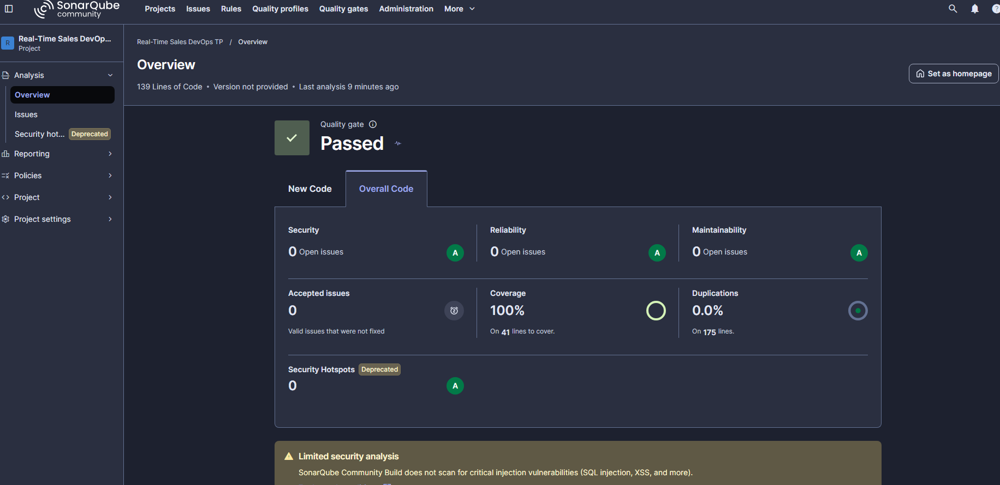

# Rapport — Industrialisation d'une pipeline Big Data avec CI/CD

**Projet :** Real-Time Sales Analytics Pipeline
**Branche de travail :** `dev`
**Technologies :** FastAPI, Kafka, PySpark (Structured Streaming), PostgreSQL, Docker Compose, Pytest, Jenkins, SonarQube

---

## 1. Architecture du projet

### 1.1 Flux fonctionnel

```text
POST /api/orders (FastAPI)
        │  événement JSON
        ▼
Kafka — topic sales.orders
        │
        ▼
Spark Structured Streaming (spark/sales_stream.py)
        │  parsing JSON, filtre quantity > 0 et unit_price > 0
        ▼
PostgreSQL — table processed_orders (écriture JDBC via foreachBatch)
```

L'API valide la commande (modèle Pydantic), vérifie que le produit existe, calcule `total_amount`, génère un `order_id` et un `timestamp`, puis publie l'événement dans Kafka. Le job Spark consomme le topic en continu et écrit chaque micro-batch dans PostgreSQL.

### 1.2 Infrastructure Docker

| Service | Rôle |
|---|---|
| `sales-api` | API FastAPI (port 8000) |
| `zookeeper`, `kafka` | Broker Kafka (listener interne `kafka:29092`, externe `localhost:9092`) |
| `kafka-init` | Crée le topic `sales.orders` puis s'arrête (ajouté pendant le TP, voir §10) |
| `postgres` | Base `sales`, table `processed_orders` initialisée par `infra/postgres/init.sql` |
| `spark-master`, `spark-worker` | Cluster Spark standalone (`apache/spark:3.5.7`) |
| `spark-streaming` | Soumission du job `sales_stream.py` au cluster |
| `jenkins` | Serveur CI (port 8082), avec accès au socket Docker de l'hôte |
| `sonarqube`, `sonarqube-db` | Analyse de qualité (port 9000) |

Tous les services partagent le réseau Docker `data-platform`. Jenkins y étant connecté, il joint les autres services par leur nom (`kafka`, `postgres`, `sonarqube`).

L'ordre de démarrage est garanti par des `depends_on` conditionnels : Kafka et PostgreSQL doivent être `healthy`, et `kafka-init` doit s'être terminé avec succès avant le lancement du job Spark.

### 1.3 Chaîne CI

```text
Push sur dev ──► Jenkins ──► Tests unitaires ──► Tests d'intégration ──► Build ──► Tests E2E
                                                                                      │
                                              Quality Gate ◄── SonarQube ◄────────────┘
                                                   │
                                          PASS : pipeline OK / FAIL : pipeline STOP
```

---

## 2. Stratégie de tests

La stratégie suit la pyramide des tests : beaucoup de tests unitaires rapides, quelques tests d'intégration, un scénario E2E.

| Niveau | Ce qu'il valide | Dépendances | Durée |
|---|---|---|---|
| Unitaire | Règles métier et comportement de l'API, isolément | Aucune (Kafka remplacé par un mock) | ~1 s |
| Intégration | La communication entre deux composants réels | Services Docker | quelques dizaines de secondes |
| E2E | Le parcours complet, du point de vue de l'utilisateur | Toute la plateforme | quelques secondes une fois Spark démarré |

Les tests unitaires sont exécutés en premier dans Jenkins : une régression de logique métier est ainsi détectée en quelques secondes, sans démarrer l'infrastructure.

Les tests d'intégration et E2E ne s'exécutent que si `RUN_INTEGRATION_TESTS=true` et `RUN_E2E_TESTS=true`. Cette garde permet de lancer `pytest` sans Docker en local. Le Jenkinsfile positionne explicitement ces deux variables : sans elles, ces stages seraient verts sans avoir exécuté aucun test.

Tous les paramètres d'environnement sont lus depuis des variables (`KAFKA_BOOTSTRAP_SERVERS`, `POSTGRES_HOST`, etc.), avec des valeurs par défaut adaptées au poste local (`localhost`) et surchargées dans Jenkins (`kafka:29092`, `postgres`).

---

## 3. Tests unitaires réalisés

**21 tests, couverture de `app/main.py` : 100 %.**

### 3.1 Règles métier — `tests/unit/test_orders.py` (12 tests)

| Cas | Tests |
|---|---|
| Calcul du montant total | `test_order_total`, `test_order_event_contains_expected_fields` |
| Génération de l'identifiant | `test_order_contains_order_id` (préfixe `ORD-`) |
| Quantité | nulle, négative, maximum autorisé (1000), dépassement (1001) |
| Prix | nul, négatif, dépassement du maximum (100 000) |
| Identifiants | `customer_id` et `product_id` trop courts |
| Construction de l'événement | présence et valeur de tous les champs attendus |

Les cas invalides vérifient une `ValidationError` Pydantic **et** le champ concerné (`match="quantity"`, `match="unit_price"`…). Un test attendant simplement `Exception` passerait aussi en cas d'erreur sans rapport (voir §11).

### 3.2 Endpoints de l'API — `tests/unit/test_api.py` (9 tests)

Kafka est remplacé par un `MagicMock` via `monkeypatch`, ce qui permet de tester l'API sans aucun service externe et de vérifier précisément les appels au producteur.

| Test | Vérification |
|---|---|
| `test_health_returns_up` | `GET /api/health` renvoie 200 et `UP` |
| `test_products_returns_catalog` | le catalogue contient les 4 produits |
| `test_create_order_returns_201_and_event` | cas nominal : 201, total calculé, `order_id` généré |
| `test_create_order_publishes_event_to_kafka` | l'événement est envoyé sur le bon topic, puis `flush` et `close` |
| `test_create_order_unknown_product_returns_404` | produit inconnu : 404 et **aucun** envoi Kafka |
| `test_create_order_invalid_quantity_returns_422` | la validation bloque avant Kafka |
| `test_create_order_missing_field_returns_422` | champ manquant : 422 |
| `test_producer_is_closed_even_if_kafka_fails` | panne Kafka simulée (`KafkaTimeoutError`) : le producteur est quand même fermé |
| `test_create_kafka_producer_configuration` | configuration du producteur et sérialisation JSON |

Le test de panne Kafka couvre un cas limite qu'un test d'intégration ne peut pas reproduire facilement.

```bash
pytest tests/unit --cov=app --cov-report=term-missing --cov-report=xml:coverage.xml
```

---

## 4. Tests d'intégration réalisés

Ils utilisent réellement les services Docker.

### Test A — API → Kafka (`tests/integration/test_api.py`)

- `test_health` : l'API répond.
- `test_api_publishes_order_to_kafka` : une commande envoyée à l'API est retrouvée par un `KafkaConsumer` dans le topic `sales.orders`.

### Test B — Kafka → Spark → PostgreSQL (`tests/integration/test_spark_postgres.py`)

`test_kafka_spark_postgres_pipeline` publie directement un événement dans Kafka (identifiant unique `TEST-xxxx`), puis interroge PostgreSQL jusqu'à trouver la ligne correspondante dans `processed_orders`, et vérifie chaque champ.

L'attente repose sur un **polling avec timeout** : une requête par seconde, jusqu'à `PIPELINE_TIMEOUT_SECONDS` (30 s par défaut, 180 s dans Jenkins). Le test s'arrête dès que la ligne apparaît et échoue proprement avec un message explicite si le délai est dépassé. Aucun `time.sleep` arbitraire.

---

## 5. Scénario E2E

Fichier : `tests/e2e/test_sales_pipeline.py`

- **Given** : l'infrastructure est démarrée.
- **When** : une commande est envoyée à l'API (`C-E2E-001`, produit `P004`, quantité 2, prix unitaire 399,90).
- **Then** :
  1. l'API répond 201 avec un événement complet et `total_amount = 799,80` ;
  2. l'événement est publié dans Kafka ;
  3. il est consommé et traité par Spark ;
  4. il est enregistré dans `processed_orders` ;
  5. la ligne contient exactement les valeurs attendues.

Même mécanisme de polling avec timeout que le test d'intégration B.

---

## 6. Pipeline Jenkins

Le `Jenkinsfile` est versionné avec le code et lu depuis le dépôt (*Pipeline script from SCM*, branche `*/dev`). Toute modification de la pipeline passe donc par un commit et est exécutée avec la version du code qu'elle teste.

| Stage | Rôle |
|---|---|
| Checkout | Récupération du code de la branche `dev` |
| Environment | Vérification de `python3`, `docker`, `docker-compose` |
| Install | Installation des dépendances Python |
| Unit Tests | Tests unitaires, génération de `coverage.xml` et `test-results-unit.xml` |
| Integration Tests | Nettoyage des conteneurs, démarrage de l'infrastructure, attente de Kafka puis de Spark (`Initial offsets`), exécution des tests |
| Build | Construction des images `sales-api` et `spark-streaming` |
| E2E Tests | Scénario complet |
| Cleanup before SonarQube | Arrêt des conteneurs de la plateforme pour libérer de la mémoire |
| SonarQube | Analyse avec SonarScanner |
| Quality Gate | `waitForQualityGate abortPipeline: true`, timeout 5 minutes |

En pipeline déclarative, l'échec d'un stage entraîne l'arrêt immédiat : les stages suivants sont marqués *skipped* et le build passe en FAILURE. Les rapports (`coverage.xml`, `test-results-*.xml`) sont archivés dans un bloc `post { always { ... } }`.

Configuration Jenkins :

- plugins Pipeline, Git, SonarQube Scanner, Pipeline: Stage View ;
- outil `SonarScanner` (installation automatique) ;
- serveur `SonarQube` à l'adresse `http://sonarqube:9000` ;
- credential `sonarqube-token` (Secret text) contenant le token d'analyse.

---

## 7. Configuration SonarQube

Version : SonarQube Community Build (mode MQR).

```properties
sonar.projectKey=real-time-sales-devops
sonar.projectName=Real-Time Sales DevOps TP

sonar.sources=app,spark
sonar.tests=tests
sonar.sourceEncoding=UTF-8
sonar.python.version=3.11

sonar.python.coverage.reportPaths=coverage.xml
sonar.coverage.exclusions=spark/**

sonar.python.xunit.reportPath=test-results-unit.xml

sonar.exclusions=**/__pycache__/**,**/.pytest_cache/**
```

- **`sonar.sources=app,spark`** : l'API **et** le job Spark sont analysés (bugs, vulnérabilités, code smells, duplications). Initialement, seul `app` l'était (voir §10).
- **`sonar.coverage.exclusions=spark/**`** : la couverture est mesurée pendant les tests unitaires. Le job Spark ne peut pas être testé unitairement de façon réaliste (cluster Spark, Kafka, PostgreSQL) ; il est validé par les tests d'intégration et E2E, qui ne produisent pas de rapport de couverture. Sans cette exclusion, il apparaîtrait à 0 % alors qu'il est testé. L'indicateur reflète donc la couverture unitaire du code testable unitairement.
- **Webhook** SonarQube → Jenkins : `http://jenkins:8080/sonarqube-webhook/` (port interne du conteneur). Il notifie Jenkins de la fin de l'analyse ; sans lui, le stage Quality Gate attend jusqu'au timeout.

---

## 8. Quality Gate

Quality Gate personnalisé `TP Real-Time Sales`, défini comme gate par défaut, conditions sur l'ensemble du code :

| Métrique | Condition d'échec | Traduction |
|---|---|---|
| Coverage | < 80 % | couverture ≥ 80 % |
| Duplicated Lines (%) | > 3 % | duplications ≤ 3 % |
| Reliability Rating | pire que A | 0 bug |
| Security Rating | pire que A | 0 vulnérabilité |

Dans Jenkins, `waitForQualityGate abortPipeline: true` attend le verdict transmis par le webhook et fait échouer le build si le gate échoue. Une dégradation de la qualité bloque donc la pipeline au même titre qu'un test en échec.

---

## 9. Résultats obtenus

### 9.1 Jenkins

- Pipeline complète au vert, de *Checkout* à *Quality Gate*, en **1 min 10 à 1 min 35**.
- Stage *Integration Tests* : environ **45 s** (démarrage de l'infrastructure et de Spark compris).
- Détection de régression : un test volontairement faussé (`total_amount == 999.0`) fait échouer les tests unitaires (`1 failed, 20 passed`), ce qui arrête la pipeline dès le stage *Unit Tests*. Après `git revert`, la pipeline repasse au vert.



### 9.2 SonarQube

| Métrique | Première analyse (périmètre `app`) | Après élargissement à `spark` | Après corrections |
|---|---|---|---|
| Lignes de code | 63 | augmentation (ajout de `spark/`) | 139 |
| Bugs | 0 | 0 | 0 |
| Vulnérabilités | 0 | **1** (High) | 0  |
| Code smells | 9 | 9 | 0 |
| Couverture | 100 % | 100 % | 100 % |
| Duplications | 0,0 % | 0,0 % | 0% |
| Quality Gate | Passed | Passed | Passed |



### 9.3 Couverture

Passage de **71 %** à **100 %** sur `app/main.py` (41 instructions) grâce aux tests unitaires des endpoints.

---

## 10. Problèmes rencontrés

**1. Job Spark arrêté au démarrage.** Le conteneur `spark-streaming` s'arrêtait avec `UnknownTopicOrPartitionException`. Kafka n'ayant pas de volume, le topic `sales.orders` disparaît à chaque recréation du conteneur et n'est recréé qu'au premier message de l'API. Spark démarrait avant, ne trouvait pas le topic et la requête de streaming s'arrêtait. Les tests Kafka → Spark → PostgreSQL et E2E échouaient alors que le code était correct.

**2. Spark très lent : image ARM en émulation.** L'image `treeverse/bitnami-spark:3.5` n'existe qu'en `arm64`. Sur un poste `amd64`, Docker l'exécutait en émulation : le premier micro-batch prenait environ 75 s, alors que les tests attendaient 30 s. Les tests échouaient par timeout, bien que la commande arrive ensuite dans PostgreSQL (vérifié par requête SQL).

**3. Jenkins exécutait un autre Jenkinsfile.** Le premier build échouait au stage *Install* (`externally-managed-environment`), puis dans le bloc `post` (`No such DSL method 'junit'`). La console montrait que Jenkins lisait la branche `dev`, qui ne contenait que la version initiale du projet, alors que le travail du groupe avait été fait sur `main`. La CI ne testait donc pas le code réellement développé.

**4. Couverture insuffisante.** 71 % seulement : les endpoints de l'API (lignes 53, 62, 67, 72-84 de `app/main.py`) n'étaient exercés par aucun test unitaire. Seuls les tests unitaires produisant le rapport de couverture, le seuil de 80 % n'était pas atteignable.

**5. Périmètre SonarQube incomplet.** `sonar.sources=app` : le job Spark, cœur du traitement de données, n'était pas analysé.

**6. Problèmes détectés par SonarQube** après élargissement du périmètre :

| Catégorie | Nb | Fichier | Problème |
|---|---|---|---|
| Vulnerability (Security, High) | 1 | `spark/sales_stream.py` | Checkpoint Spark dans `/tmp`, répertoire accessible en écriture à tous |
| Code smell (High) | 1 | `app/main.py` | Réponse 404 non documentée dans OpenAPI |
| Code smell (Medium) | 8 | `tests/unit/test_orders.py` | `pytest.raises(Exception)` trop large |
| Bugs | 0 | — | — |
| Duplications | — | — | 0,0 % |

---

## 11. Corrections réalisées

**1. Création automatique du topic.** Ajout d'un service `kafka-init` qui crée `sales.orders` (`--if-not-exists`) dès que Kafka est `healthy`, puis s'arrête. `spark-streaming` dépend de lui avec la condition `service_completed_successfully` : l'ordre de démarrage est garanti par Docker, sans intervention manuelle.

**2. Délai des tests configurable, puis image Spark native.** Le délai de polling est lu depuis `PIPELINE_TIMEOUT_SECONDS` (30 s par défaut, 180 s dans Jenkins). Le test reste rapide quand Spark est prêt, et tolère un premier micro-batch lent. Puis l'image Spark a été remplacée par l'image officielle multi-architecture `apache/spark:3.5.7` (master et worker lancés par `spark-class`, connecteur Kafka aligné en 3.5.7) : Spark tourne en natif et le stage d'intégration passe à environ 45 s.

**3. Rassemblement du travail sur `dev`.** Fusion de `main` dans `dev`. Deux conflits résolus manuellement :

- `docker-compose.yml` : configuration du groupe conservée (`kafka-init`, healthchecks, dépendances), images Spark de la version de référence intégrées ;
- `docker/spark/Dockerfile` : base `apache/spark:3.5.7`.

Le Jenkinsfile exécuté est désormais celui du groupe (installation avec `--break-system-packages`, requis par la Debian de l'image Jenkins conformément au PEP 668). Tout le groupe travaille sur `dev`.

**4. Tests unitaires des endpoints.** Ajout de `tests/unit/test_api.py` (9 tests, Kafka mocké) : couverture de 71 % à 100 %.

**5. Élargissement de l'analyse SonarQube** à `spark/`, avec exclusion justifiée de la couverture (§7).

**6. Corrections qualité :**

- `spark/sales_stream.py` : checkpoint déplacé hors de `/tmp`, dans `/opt/spark-app/checkpoints/sales`, et rendu configurable par `CHECKPOINT_LOCATION` ;
- `app/main.py` : ajout de `responses={404: {"description": "Unknown product"}}` sur `POST /api/orders` ; la documentation OpenAPI liste désormais 201, 404 et 422 ;
- `tests/unit/test_orders.py` : `pytest.raises(ValidationError, match="<champ>")` à la place de `pytest.raises(Exception)`.

### Pistes d'amélioration

- Ajouter une limite de temps aux boucles `until` du stage *Integration Tests* : si Spark ne démarre pas, le build doit échouer au lieu d'attendre indéfiniment.
- Supprimer du Jenkinsfile la création manuelle du topic et le redémarrage de Spark, devenus redondants avec `kafka-init`.
- Installer les dépendances dans un environnement virtuel plutôt qu'avec `--break-system-packages`.
- Déclencher Jenkins automatiquement à chaque push (webhook du dépôt) au lieu d'un lancement manuel.
- Externaliser les identifiants PostgreSQL (actuellement en clair dans `docker-compose.yml`).

---

## Annexe — Question de synthèse

> Comment garantir automatiquement qu'une modification apportée à une pipeline Data ne dégrade ni son fonctionnement ni la qualité du code ?

En combinant plusieurs contrôles automatiques, déclenchés à chaque modification, qui bloquent l'intégration dès que l'un d'eux échoue.

- **Git** et le travail sur une branche dédiée (`dev`) isolent les changements ; la Merge Request n'est acceptée qu'une fois la CI verte.
- **Les tests unitaires** vérifient les règles métier en quelques secondes, sans infrastructure.
- **Les tests d'intégration** vérifient que les composants communiquent réellement (API → Kafka, Kafka → Spark → PostgreSQL).
- **Le test E2E** vérifie le résultat final attendu par l'utilisateur.
- **Jenkins** orchestre ces étapes dans un ordre fixe, du plus rapide au plus coûteux, et s'arrête au premier échec.
- **SonarQube** mesure la qualité du code (bugs, vulnérabilités, code smells, duplications, couverture).
- **Le Quality Gate** transforme ces mesures en décision : sous le seuil, la pipeline est stoppée.

Ce TP l'a illustré concrètement : les tests ont révélé un problème d'ordre de démarrage invisible à la lecture du code, et l'élargissement de l'analyse SonarQube a révélé une vulnérabilité dans le job Spark qui serait sinon passée inaperçue.
